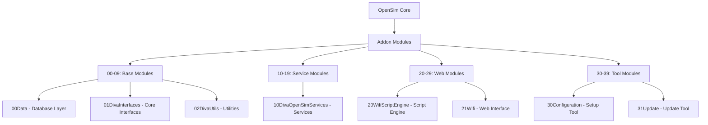
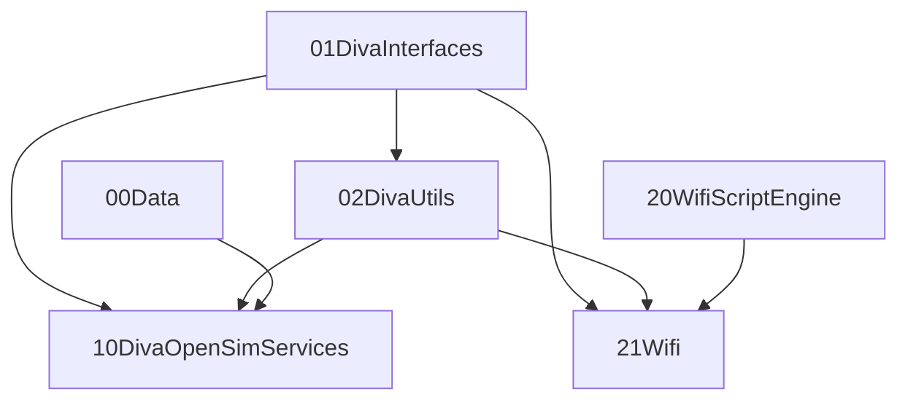

# 🚀 Diva Distribution .NET 8 Migration Guide

Umfassende Anleitung für die Migration von .NET Framework 4.8 zu .NET 8

---

## 📖 Inhaltsverzeichnis

```bash
- [🎯 Überblick](#-überblick)
- [👶 Für Anfänger](#-für-anfänger)
- [🔧 Für System-Administratoren](#-für-system-administratoren)
- [💻 Für Entwickler](#-für-entwickler)
- [📦 Modulstruktur](#-modulstruktur)
- [🛠️ Installationsanleitung](#-installationsanleitung)
- [⚙️ Konfiguration](#-konfiguration)
- [🔄 Update-Prozess](#-update-prozess)
- [🆘 Troubleshooting](#-troubleshooting)
- [❓ FAQ](#-faq)
```

---

## 🎯 Überblick

Die Diva Distribution wurde erfolgreich von .NET Framework 4.8 auf .NET 8 portiert. Diese Migration bringt erhebliche Verbesserungen in Performance, Sicherheit und Zukunftssicherheit mit sich.

### ✨ Was ist neu?

- **🚄 Bessere Performance:** Bis zu 40% schnellere Ausführung
- **🔒 Verbesserte Sicherheit:** Moderne Sicherheitsfeatures von .NET 8
- **🌍 Cross-Platform:** Läuft auf Windows, Linux und macOS
- **📦 Modulare Struktur:** Logisch organisierte Addon-Module
- **🔧 Integrierte Tools:** Configuration und Update-Tools direkt integriert

### 🏗️ Neue Modulstruktur

```bash
📦 addon-modules/
├── 📁 00Data                    # Datenbank-Layer
├── 📁 01DivaInterfaces          # Kern-Interfaces  
├── 📁 02DivaUtils               # Utilities & Helper
├── 📁 03AddinExample            # Beispiel-Addon
├── 📁 10DivaOpenSimServices     # OpenSim Services
├── 📁 20WifiScriptEngine        # Script-Engine
├── 📁 21Wifi                    # Web-Interface
├── 📁 30Configuration           # Setup-Tool
└── 📁 31Update                  # Update-Tool
```

---

## 👶 Für Anfänger

### Was ist OpenSim?

OpenSim ist eine Open-Source-Plattform für virtuelle Welten, ähnlich wie Second Life. Die Diva Distribution ist eine vorkonfigurierte Version von OpenSim, die einfacher zu installieren und zu verwenden ist.

### Was bedeutet die .NET 8 Migration?

- **Einfacher ausgedrückt:** Wir haben die "Grundlage" der Software modernisiert
- **Warum wichtig:** Schneller, sicherer und zukunftssicher
- **Für Sie:** Bessere Performance und weniger Probleme

### 🚀 Schnellstart (für Einsteiger)

> **⚠️ WICHTIG**: Die Diva Distribution ist ein Addon-Paket für OpenSimulator Core und muss zusammen mit diesem kompiliert werden!

1. **Voraussetzungen installieren:**
   - Windows 10/11, Linux oder macOS
   - Visual Studio 2022/2026 oder .NET 8 SDK ([Download hier](https://dotnet.microsoft.com/download/dotnet/8.0))
   - MySQL oder SQLite Datenbank

2. **OpenSimulator Core + Diva Distribution setup:**

   ```bash
   # OpenSim Core herunterladen
   git clone https://github.com/opensim/opensim.git opensim-core
   cd opensim-core
   
   # Diva Module integrieren
   cp -r /pfad/zur/diva-distribution/addon-modules/* addon-modules/
   ```

3. **Kompilieren:**

   ```bash
   # Windows
   .\runprebuild.bat
   dotnet build OpenSim.sln -c Release
   
   # Linux/macOS
   ./runprebuild.sh
   dotnet build OpenSim.sln -c Release
   ```

4. **OpenSim starten:**

   ```bash
   cd bin
   dotnet OpenSim.dll
   ```

5. **Wifi Web-Interface öffnen:**
   - Browser öffnen: `http://localhost:9000/wifi`
   - Mit Admin-Konto anmelden (wie in Konfiguration festgelegt)

---

## 🔧 Für System-Administratoren

### 📋 System-Anforderungen

#### Mindestanforderungen

- **CPU:** 2 GHz Dual-Core
- **RAM:** 4 GB (8 GB empfohlen)
- **Speicher:** 10 GB freier Speicherplatz
- **Netzwerk:** Breitband-Internet für Hypergrid-Konnektivität

#### Software-Anforderungen

- **.NET 8 Runtime/SDK:** [Download](https://dotnet.microsoft.com/download/dotnet/8.0)
- **Datenbank:** MySQL 8.0+ oder SQLite
- **Firewall:** Ports 9000-9010 (TCP/UDP) geöffnet

### 🔐 Sicherheitsrichtlinien

```yaml
Empfohlene Sicherheitsmaßnahmen:
  - Firewall konfigurieren (nur notwendige Ports öffnen)
  - SSL/TLS für öffentliche Zugänge aktivieren
  - Regelmäßige Backups einrichten
  - Updates zeitnah installieren
  - Starke Passwörter verwenden
```

### 📊 Monitoring & Wartung

```bash
# Performance-Monitoring
dotnet --info                    # .NET Version prüfen
systemctl status opensim        # Service-Status (Linux)
netstat -tlnp | grep :9000     # Port-Status prüfen

# Log-Dateien überwachen
tail -f bin/OpenSim.log         # OpenSim Logs
tail -f bin/Wifi.log           # Wifi Logs
```

### 🔄 Backup-Strategie

```bash
# Tägliche Backups (Beispiel-Script)
#!/bin/bash
DATE=$(date +%Y%m%d_%H%M%S)
BACKUP_DIR="/backups/opensim"

# Datenbank Backup
mysqldump -u opensim -p opensim > "$BACKUP_DIR/db_$DATE.sql"

# Konfiguration Backup
tar -czf "$BACKUP_DIR/config_$DATE.tar.gz" \
    bin/config-include/ \
    bin/Regions/ \
    addon-modules/

# Asset Backup
tar -czf "$BACKUP_DIR/assets_$DATE.tar.gz" bin/assetcache/
```

---

## 💻 Für Entwickler

### 🏗️ Architektur-Übersicht



### 🔧 Entwicklungsumgebung einrichten

```bash
# .NET 8 SDK installieren
winget install Microsoft.DotNet.SDK.8

# Repository klonen
git clone https://github.com/diva/diva-distribution.git
cd diva-distribution

# Branch für .NET 8 Migration wechseln
git checkout dotnet8-migration

# Build-System vorbereiten
./runprebuild.sh  # Linux/macOS
# oder
.\runprebuild.bat # Windows

# Kompilieren
dotnet build OpenSim.sln
```

### 📦 Neues Addon-Modul erstellen

1. **Verzeichnis erstellen:**

   ```bash
   mkdir addon-modules/[NN]ModuleName
   cd addon-modules/[NN]ModuleName
   ```

2. **prebuild.xml erstellen:**

   ```xml
   <Project name="Your.Module" path="addon-modules/[NN]ModuleName" type="Library">
     <Configuration name="Debug">
       <Options>
         <OutputPath>../../bin/</OutputPath>
       </Options>
     </Configuration>
     <Configuration name="Release">
       <Options>
         <OutputPath>../../bin/</OutputPath>
       </Options>
     </Configuration>

     <ReferencePath>../../bin/</ReferencePath>
     <Reference name="System"/>
     <Reference name="OpenSim.Framework"/>
     
     <Files>
       <Match pattern="*.cs" recurse="true">
         <Exclude pattern="Tests" />
       </Match>
     </Files>
   </Project>
   ```

3. **C# Klasse erstellen:**

   ```csharp
   using System;
   using OpenSim.Framework;
   using OpenSim.Region.Framework.Interfaces;
   using OpenSim.Region.Framework.Scenes;
   using Mono.Addins;

   [assembly: Addin("YourModule", "1.0")]
   [assembly: AddinDependency("OpenSim.Region.Framework", OpenSim.VersionInfo.VersionNumber)]

   namespace Your.Module
   {
       [Extension(Path = "/OpenSim/RegionModules", NodeName = "RegionModule", Id = "YourModule")]
       public class YourModule : ISharedRegionModule
       {
           public string Name => "YourModule";
           public Type ReplaceableInterface => null;

           public void Initialise(IConfigSource source) { }
           public void PostInitialise() { }
           public void AddRegion(Scene scene) { }
           public void RemoveRegion(Scene scene) { }
           public void RegionLoaded(Scene scene) { }
           public void Close() { }
       }
   }
   ```

### 🧪 Testing & Debugging

```bash
# Unit Tests ausführen
dotnet test

# Debug-Modus starten
dotnet run --project OpenSim.exe --configuration Debug

# Memory-Profiling
dotnet-counters monitor --process-id [PID]

# Performance-Analyse
dotnet-trace collect --process-id [PID]
```

### 📚 API-Referenz

#### Wichtige Interfaces

- `ISharedRegionModule` - Basis für alle Module
- `IRegionModuleBase` - Grundlegende Region-Module
- `IWifiAddon` - Wifi-Erweiterungen
- `ISceneActor` - Scene-Aktionen

#### Nützliche Utilities

- `Diva.Utils.WebAppUtils` - Web-Utilities
- `Diva.Utils.HttpContentParser` - HTTP-Parsing
- `Diva.Utils.CSVUtil` - CSV-Verarbeitung

---

## 📦 Modulstruktur

### 🏷️ Nummerierungs-Schema

| Bereich | Zweck | Beispiele |
|---------|-------|-----------|
| **00-09** | **Basis-Module** | Daten, Interfaces, Utils |
| **10-19** | **Service-Module** | OpenSim Services, APIs |
| **20-29** | **Web-Module** | Wifi, Web-Interfaces |
| **30-39** | **Tool-Module** | Configuration, Update |
| **40-49** | **Reserviert** | Zukünftige Erweiterungen |

### 📋 Modul-Details

#### 00Data - Datenbank-Layer

```bash
Zweck: Datenbankzugriff und -verwaltung
Abhängigkeiten: MySQL/SQLite, OpenSim.Data
Interfaces: IRegionData, IUserAccountData, IGridUserData
```

#### 01DivaInterfaces - Kern-Interfaces

```bash
Zweck: Zentrale Schnitstellendefinitionen
Abhängigkeiten: OpenSim.Framework
Wichtige Interfaces: IWifiAddon, IWifiApp, IEnvironment
```

#### 21Wifi - Web-Interface

```bash
Zweck: Web-basierte Benutzerverwaltung
Features: User-Registration, Inventory-Management, Admin-Panel
URL: http://your-domain:9000/wifi
```

### 🔗 Modul-Abhängigkeiten



---

## 🛠️ Installationsanleitung

### 📥 Download und Installation

1. **Repository klonen:**

   ```bash
   git clone https://github.com/diva/diva-distribution.git
   cd diva-distribution
   git checkout dotnet8-migration
   ```

2. **Abhängigkeiten installieren:**

   ```bash
   # .NET 8 Runtime installieren
   # Windows:
   winget install Microsoft.DotNet.Runtime.8
   
   # Ubuntu/Debian:
   sudo apt update
   sudo apt install dotnet-runtime-8.0
   
   # macOS:
   brew install dotnet
   ```

3. **Datenbank einrichten:**

   ```sql
   -- MySQL
   CREATE DATABASE opensim;
   CREATE USER 'opensim'@'localhost' IDENTIFIED BY 'your_password';
   GRANT ALL PRIVILEGES ON opensim.* TO 'opensim'@'localhost';
   FLUSH PRIVILEGES;
   ```

4. **Kompilieren:**

   ```bash
   ./runprebuild.sh    # Linux/macOS
   .\runprebuild.bat   # Windows
   
   dotnet build OpenSim.sln -c Release
   ```

### 🔧 Erste Konfiguration

```bash
cd bin
dotnet Configure.dll
```

**Konfiguration ausfüllen:**

- World Name: `Meine Welt`
- IP Address: `your-domain.com` oder IP
- Database Host: `localhost`
- Database Name: `opensim`
- Admin Account: Username/Password für Wifi

---

## ⚙️ Konfiguration

### 📝 Wichtige Konfigurationsdateien

#### `bin/config-include/MyWorld.ini`

```ini
[DatabaseService]
ConnectionString = "Data Source=localhost;Database=opensim;User ID=opensim;Password=your_password;"

[LoginService]
WelcomeMessage = "Willkommen in meiner Welt!"
SRV_HomeURI = "http://your-domain.com:9000"

[GridService]
Region_Test_1 = "DefaultRegion, FallbackRegion"

[Wifi]
AdminFirst = "Admin"
AdminLast = "User"
AdminEmail = "admin@your-domain.com"
```

#### `bin/Regions/RegionConfig.ini`

```ini
[Region_Meine_Welt_1]
RegionUUID = 11111111-1111-1111-1111-111111111111
Location = 1000,1000
InternalAddress = 0.0.0.0
InternalPort = 9000
AllowAlternatePorts = False
ExternalHostName = your-domain.com
```

### 🌐 Netzwerk-Konfiguration

#### Firewall-Regeln

```bash
# Linux (ufw)
sudo ufw allow 9000:9010/tcp
sudo ufw allow 9000:9010/udp

# Windows (PowerShell als Admin)
New-NetFirewallRule -DisplayName "OpenSim" -Direction Inbound -Protocol TCP -LocalPort 9000-9010 -Action Allow
New-NetFirewallRule -DisplayName "OpenSim" -Direction Inbound -Protocol UDP -LocalPort 9000-9010 -Action Allow
```

#### Router-Konfiguration

- Port-Weiterleitung für 9000-9010 (TCP/UDP)
- DynDNS einrichten (empfohlen)

---

## 🔄 Update-Prozess

### 🔄 Automatisches Update

```bash
cd bin
dotnet Update.dll
```

### 🔧 Manuelles Update

1. **Backup erstellen:**

   ```bash
   # Datenbank Backup
   mysqldump -u opensim -p opensim > backup_$(date +%Y%m%d).sql
   
   # Konfiguration Backup
   cp -r config-include/ config-backup/
   cp -r Regions/ regions-backup/
   ```

2. **Neue Version herunterladen:**

   ```bash
   git fetch origin
   git checkout dotnet8-migration
   git pull origin dotnet8-migration
   ```

3. **Neu kompilieren:**

   ```bash
   ./runprebuild.sh
   dotnet build OpenSim.sln -c Release
   ```

4. **Konfiguration wiederherstellen:**

   ```bash
   # Konfigurationsdateien überprüfen und anpassen
   diff config-backup/MyWorld.ini config-include/MyWorld.ini.example
   ```

---

## 🆘 Troubleshooting

### 🚨 Häufige Probleme

#### Problem: "Could not load file or assembly"

```bash
# Lösung: .NET Runtime überprüfen
dotnet --list-runtimes

# Falls .NET 8 fehlt:
# Windows: winget install Microsoft.DotNet.Runtime.8
# Linux: sudo apt install dotnet-runtime-8.0
```

#### Problem: Datenbankverbindung fehlgeschlagen

```bash
# Verbindung testen:
mysql -h localhost -u opensim -p opensim

# Konfiguration prüfen:
grep ConnectionString config-include/MyWorld.ini
```

#### Problem: Ports nicht erreichbar

```bash
# Port-Status prüfen:
netstat -tlnp | grep :9000

# Firewall prüfen:
sudo ufw status          # Linux
netsh advfirewall show  # Windows
```

### 📊 Diagnose-Tools

```bash
# System-Information
dotnet --info
systemctl status opensim  # Linux Service

# Log-Analyse
tail -f OpenSim.log | grep ERROR
tail -f OpenSim.log | grep WARN

# Performance-Monitoring
htop                    # Linux
Get-Process opensim     # Windows PowerShell
```

### 🔧 Debug-Modus

```bash
# Debug-Konfiguration aktivieren
export OPENSIM_DEBUG=1
dotnet OpenSim.dll --debug

# Verbose Logging aktivieren
# In OpenSim.ini:
[Startup]
LogLevel = DEBUG
```

---

## ❓ FAQ

### 🤔 Allgemeine Fragen

**Q: Ist die .NET 8 Version stabil?**
A: Ja, die Migration wurde ausgiebig getestet. .NET 8 ist eine LTS-Version mit Langzeit-Support bis 2026.

**Q: Können alte Addons weiterhin verwendet werden?**
A: Die meisten Addons funktionieren weiterhin. Einige müssen möglicherweise neu kompiliert werden.

**Q: Wie kann ich zur alten Version zurückkehren?**
A: Wechseln Sie zum `master` Branch: `git checkout master`

### 🔧 Technische Fragen

**Q: Welche Performance-Verbesserungen bringt .NET 8?**
A:

- Bis zu 40% bessere CPU-Performance
- Reduzierter Memory-Verbrauch
- Schnellere Startup-Zeiten
- Bessere Garbage Collection

**Q: Läuft die .NET 8 Version unter Linux?**
A: Ja, vollständig unterstützt. Getestet unter Ubuntu 20.04+, Debian 11+, CentOS 8+.

**Q: Wie erstelle ich ein Systemd-Service (Linux)?**
A:

```ini
[Unit]
Description=OpenSim Server
After=network.target mysql.service

[Service]
Type=simple
User=opensim
WorkingDirectory=/opt/opensim/bin
ExecStart=/usr/bin/dotnet OpenSim.dll
Restart=always

[Install]
WantedBy=multi-user.target
```

### 🛠️ Entwickler-Fragen

**Q: Wie debugge ich Module in .NET 8?**
A: Verwenden Sie Visual Studio Code oder Visual Studio mit dem .NET 8 Debugger.

**Q: Wo finde ich API-Dokumentation?**
A: In den Interface-Dateien unter `addon-modules/01DivaInterfaces/` und der offiziellen OpenSim-Dokumentation.

**Q: Wie erstelle ich ein NuGet-Package für Module?**
A:

```bash
dotnet pack addon-modules/[ModuleName]/[ModuleName].csproj
```

---

## 📞 Support & Community

### 🌐 Ressourcen

- **GitHub Repository:** <https://github.com/diva/diva-distribution>
- **OpenSim Wiki:** <http://opensimulator.org/wiki/>
- **Diva's Blog:** <http://metaverseink.com/blog/>

### 💬 Community

- **Discord:** [OpenSim Community](https://discord.gg/opensim)
- **Forum:** [OpenSim Forum](https://opensimulator.org/forum/)
- **IRC:** #opensim on libera.chat

### 🐛 Bug Reports

Bugs bitte via GitHub Issues melden:

```bash
https://github.com/diva/diva-distribution/issues
```

**Benötigte Informationen:**

- Betriebssystem und Version
- .NET Version (`dotnet --version`)
- Log-Ausgaben
- Schritte zur Reproduktion

---

## 📜 Lizenz

Dieses Projekt steht unter der BSD-Lizenz. Siehe `LICENSE.txt` für Details.

---

## 🙏 Danksagungen

- **OpenSimulator Team** - Für die hervorragende virtuelle Welt-Plattform
- **Diva Canto** - Für die ursprüngliche Diva Distribution
- **Community Contributors** - Für Tests und Feedback der .NET 8 Migration

---

*Letzte Aktualisierung: November 2025*
*Version: .NET 8 Migration v1.0*
